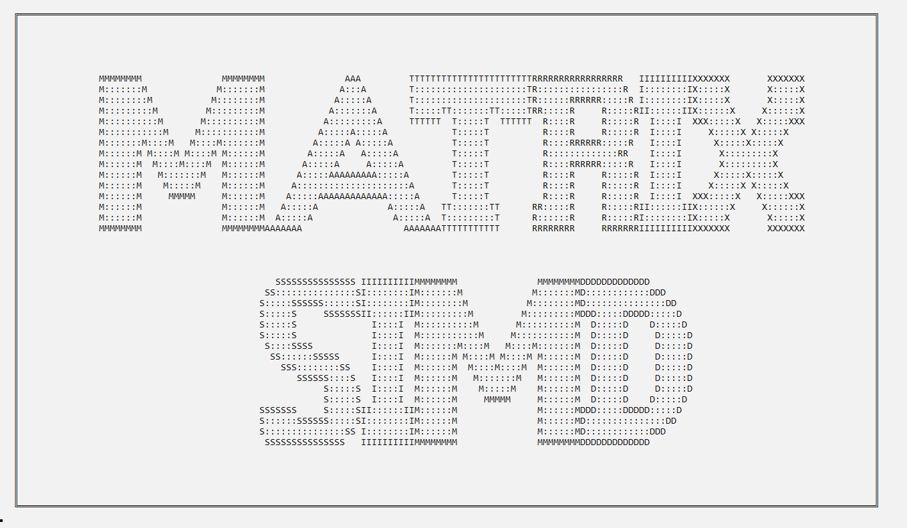

Вариант 3
821704
Фабишевская и Волчёк 

Описание модели: краткое описание особенностей
Первоначальные матрицы A, B, E, G заданных размерностей pxm, mxq, 1xm, pxq формируются при помощи генератора псевдослучайных чисел. Размерности матриц p, m, q вводятся пользователем. Модель использует n процессорных элементов (n задается пользователем), которые реализуют функции ввода входных значений (два операнда и знак команды), вывода результирующего значения, сложения, вычитания, умножения, минимума из двух значений. Условные времена выполнения операций сложения, вычитания, умножения, минимума из двух значений вводятся пользователем. Ввод значений в процессорные элементы производится из управляющего модуля. Если количество процессорных элементов x*y  ≥ n > 1, где x*y – размерность выбранной матрицы, то каждые n элементов выбранной матрицы вычисляются параллельно. В результате работы программы на экран выводится: матрица С; условные времена, затраченные на выполнение операций сложения, вычитания, умножения, минимума среди двух значений; итоговое условное время, затраченное на выполнение всех вышеперечисленных операций.

